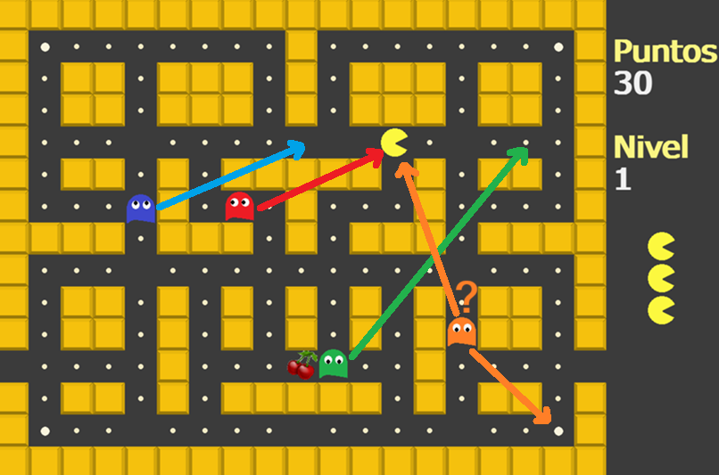
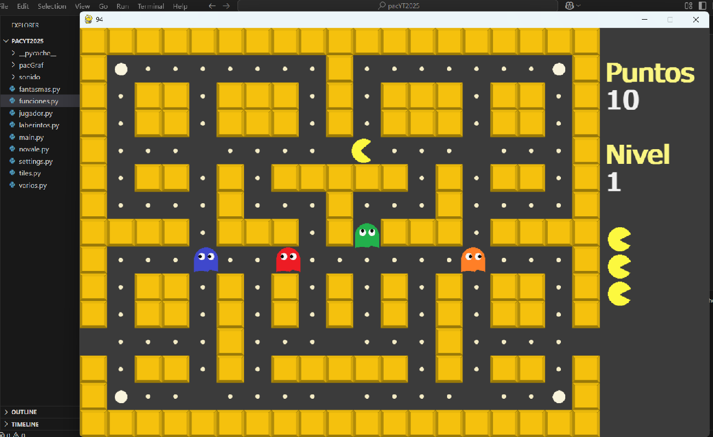
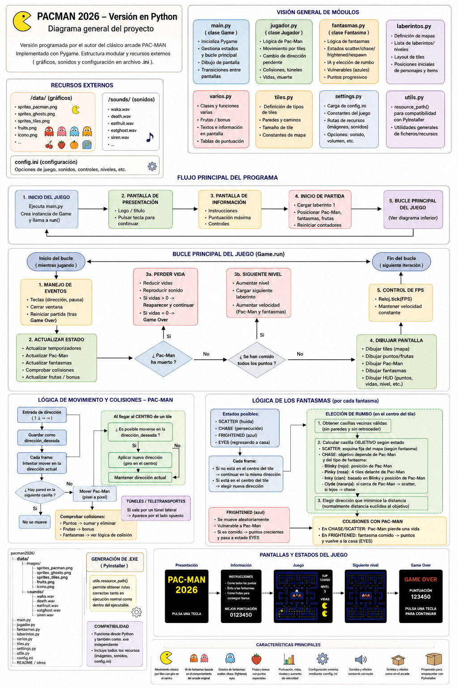

# PAC CLON 2026
## Recreación del juego clásico Pacman en Python
## El comportamiento de los fantasmas es casi
## igual que en el arcade original

- Como se puede ver en el gráfico, el fantasma rojo tiene como objetivo la posición exacta de Pacman.
- El verde tiene como objetivo, 4 casillas delante de Pacman.
- En cuanto al azul, el objetivo es un vector entre Pacman y el fantasma rojo.
- El naranja es igual que el rojo, pero al igual que el juego original, al acercarse mucho se 'asusta'.




```text
Game
├── Estado del juego
├── Puntuación
├── Vidas
├── Nivel actual
├── Sprites
└── Game Loop
    ├── Gestión de eventos
    ├── Actualización de entidades
    ├── Detección de colisiones
    └── Renderizado
```
```text
Módulos del proyecto
├── jugador.py
│   └── Lógica y comportamiento de Pac-Man
│
├── fantasmas.py
│   └── IA y comportamiento de los fantasmas
│
├── funciones.py
│   └── Funciones y lógica general del juego
│
├── laberintos.py
│   └── Definición de mapas y niveles
│
├── tiles.py
│   └── Tipos de casillas y paredes
│
├── varios.py
│   └── Objetos y elementos auxiliares
│
├── settings.py
│   └── Configuración y constantes del juego
│
└── utils.py
    └── Gestión de recursos y compatibilidad con PyInstaller
```